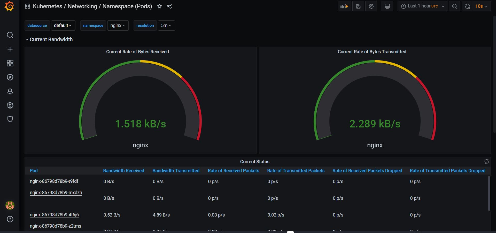

# kubernetes-monitoring
Домашку выполнил в многострадальном GKE
В качестве приложения использовал Docker образ из дз1
Задание выполнил по методу 4(**Can i play, daddy?**), используя helm3
Первоначально был установлен nginx-ingress
```bash
helm repo add ingress-nginx https://kubernetes.github.io/ingress-nginx
helm search repo -l ingress-nginx/ingress-nginx
kubectl create ns ingress-nginx
helm upgrade --install  nginx-ingress ingress-nginx/ingress-nginx --namespace=ingress-nginx --version=3.8.0
```
Далее устанавливаем prometheus-operator  и правим values(необходимо указать ip external LB)
```bash
helm repo add prometheus-community https://prometheus-community.github.io/helm-charts
helm repo update
helm search repo prometheus-community
helm show values prometheus-community/kube-prometheus-stack > prometheus-operator-values.yaml
nano prometheus-operator-values.yaml
kubectl create ns monitoring
helm upgrade --install prometheus-operator prometheus-community/kube-prom etheus-stack  --namespace=monitoring -f prometheus-operator-values.yaml
kubectl --namespace monitoring get pods -l "release=prometheus-operator"
```
После того как все заработало ставим наше приложение из дз1
```bash
kubectl create ns nginx
kubectl apply -f deployment.yaml  -n nginx
kubectl apply -f service.yaml  -n nginx
kubectl get po -A
kubectl get service -n nginx
curl 34.122.165.182:9113/metrics
kubectl apply -f servicemonitor.yaml
```
Создается три реплики приложения, решил немного посмотреть графики и запустил ab
```bash
kubectl get service -n nginx
ab -n 1000 -c 100 http://service_ip/
ab -n 10000 -c 100 http://service_ip/
```



